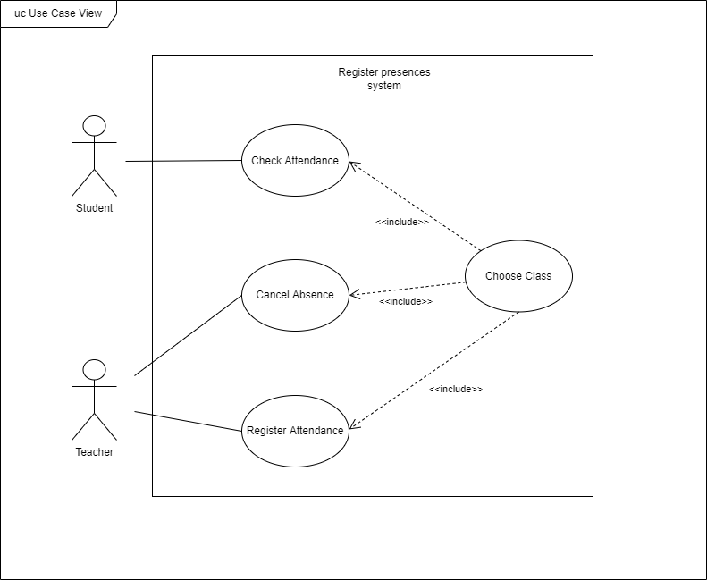

## Requirements

### Use case model

* Register Attendance

|                                      |                                                                                                                                                                                                                                                                                                                |
| ------------------------------------ | -------------------------------------------------------------------------------------------------------------------------------------------------------------------------------------------------------------------------------------------------------------------------------------------------------------- |
| *Name*                             | Register Attendance                                                                                                                                                                                                                                                                                            |
| *Actor*                            | Teacher                                                                                                                                                                                                                                                                                                        |
| *Description*                      | The teacher registers the attendance of each student.                                                                                                                                                                                                                                                          |
| *Preconditions*                    | - The class needs to be happening at the moment of registration. - If the class hasn't started yet or if the class has already ended the teacher cannot register the attendance.                                                                                                                          |
| *Postconditions*                   | - The attendance is registered and the students missing are notified                                                                                                                                                                                                                                           |
| *Normal flow*                      | 1. The teacher accesses the app main page of the register system. 2. The teacher selects the class that he wants to register  3. The system shows the list of students in the current class.  4. The teacher selects the students that are missing.  5. The system asks for confirmation. |
| *Alternative flows and exceptions* | 1. [Register failure] If, in step 5 of the normal flow the registration fails, the system gives the teacher the possibility to cancel or retry.                                                                                                                                                                |

* Receives Warning

|                                      |                                                                                                                                                                                                     |
| ------------------------------------ | --------------------------------------------------------------------------------------------------------------------------------------------------------------------------------------------------- |
| *Name*                             | Receives Warning                                                                                                                                                                                    |
| *Actor*                            | Student                                                                                                                                                                                             |
| *Description*                      | If the student is absent then he receives a notification.                                                                                                                                           |
| *Preconditions*                    | - Student is close to failing class because of absences.                                                                                                                                            |
| *Postconditions*                   | - The student receives the notification.                                                                                                                                                            |
| *Normal flow*                      | 1. The student receives the notification. 2. The notification redirects to the UC page.  3. On the page presented, it will be shown the updated number of absences of the particular UC. |
| *Alternative flows and exceptions* | 1. [Justified absence] If notification has already been sent but absence has been justified, the notification will redirect to an error page telling the user the notification is no longer valid.  |

* Cancel Absence

|                                      |                                                                                                                                                                                                       |
| ------------------------------------ | ----------------------------------------------------------------------------------------------------------------------------------------------------------------------------------------------------- |
| *Name*                             | Cancel Absence                                                                                                                                                                                        |
| *Actor*                            | Teacher                                                                                                                                                                                               |
| *Description*                      | The student was registered as absent.                                                                                                                                                                 |
| *Preconditions*                    | - The teacher needs to have marked the student's absence from class.                                                                                                                                  |
| *Postconditions*                   | - The absence is not counted.                                                                                                                                                                         |
| *Normal flow*                      | 1.The student receives notification of the absence. 2. The student shows willingness to justify the absence. And then, if he is accepted at the secretary's office, the absence will be removed. |
| *Alternative flows and exceptions* | 1. [Justification not valid] If the student isn't allowed to cancel the absence nothing else happens                                                                                                  |

* Choose class

|                                      |                                                                                                                                                                                 |
| ------------------------------------ | ------------------------------------------------------------------------------------------------------------------------------------------------------------------------------- |
| *Name*                             | Choose class                                                                                                                                                                    |
| *Actor*                            | Teacher                                                                                                                                                                         |
| *Description*                      | The teacher registers the class he's currently lecturing.                                                                                                                       |
| *Preconditions*                    | - The teacher can only access this screen while an active class is happening.                                                                                                   |
| *Postconditions*                   | - The teacher can check all students of the class in question to see which ones are missing.                                                                                    |
| *Normal flow*                      | 1.The teacher is shown a list of classes. 2.The teacher chooses the class he's currently teaching. 3. A screen with all students from the class in question is shown. |
| *Alternative flows and exceptions* | 1. [No classes happening in that moment] If no classes are happening, the user will be redirectted to an error screen with that information.                                    |

* Check Attendance

|                    |                                                                                                                                                                    |
| ------------------ | ------------------------------------------------------------------------------------------------------------------------------------------------------------------ |
| *Name*           | Check Attendance                                                                                                                                                   |
| *Actor*          | Student                                                                                                                                                            |
| *Description*    | The student checks his assiduity in each class.                                                                                                                    |
| *Preconditions*  | The teacher has marked the student absence or attendance during class.                                                                                             |
| *Postconditions* | The student can check his assiduity of the class in question.                                                                                                      |
| *Normal flow*    | 1.The teacher marks a student assiduity. 2.The student receives a notification if the teacher marks him as absent. 3.The student can check his assiduity |

### Domain Model

#### Classes

- Person: This class is a generalization for the Student and Teacher classes which contains the name and the email of all people who may be students or teachers.
- Student: This class holds the number of each student, and this way the app can separate the students from the teachers.
- Professor: Contains the number of each professor so that they can access the main app page.
- Class: Stores all the necessary information from each course unit just like an UC page of sigarra.
  In addition, gives the student the maximum number of absences allowed of the UC.
- Absence: This class saves the justification of absence of the student if it is valid and this way, the teacher can cancel the absence he gave the student at the time of the lesson.
